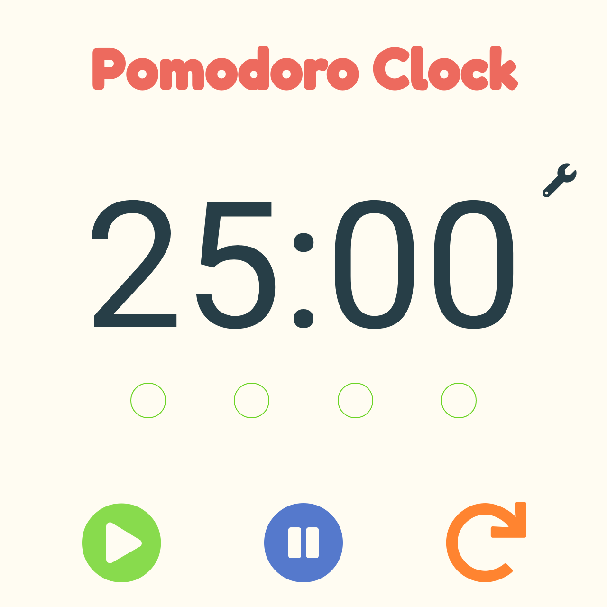

# Pomodoro Clock
> A Pair Programming Project

<div align='center'>
  
</div>

## Demo

[View the Live Demo](https://andrewbaldwin44.github.io/Pomodoro_Clock/)

## What is the Pomodoro Technique?

The Pomodoro Technique is created by Francesco Cirillo for a more productive way to work and study. The technique uses a timer to break down work into intervals, traditionally 25 minutes in length, separated by short breaks. Each interval is known as a pomodoro, from the Italian word for 'tomato', after the tomato-shaped kitchen timer that Cirillo used as a university student. [-Wikipedia](https://en.wikipedia.org/wiki/Pomodoro_Technique)

## How to use the Pomodoro Timer?

1. Decide the tasks to work on today
2. Set the amount of time you want to work on each task
3. Set the amount of time for breaks in between
4. Start timer and focus on the task for 25 minutes
5. Take a break for the allotted time when the notification dings
6. Repeat until you finish the tasks
7. Take a longer break after completing 4 'Pomodoro's'

## Features

1. The clock plays through 4 'Pomodoro's'
2. Set the amount of time for each work and break cycle
3. Pause, play, or restart the clock
4. A sound will play at the end of each cycle
5. View the clock and the current cycle in the tab bar
6. Responsive design that works on desktop and mobile

## Deploy the project

__Clone the repo to your local machine using the terminal__:
```
$ git clone git@github.com:andrewbaldwin44/Pomodoro_Clock.git
```

*Then Open the `index.html` Project File in Your Browser*

## Technologies Used:

- JavaScript
- HTML
- CSS

## Authors

👤 **Andrew Baldwin**
👤 **Dustin Simensen**

- Github: [@tunztunztunz](https://github.com/tunztunztunz)
- Github: [@andrewbaldwin44](https://github.com/andrewbaldwin44)
